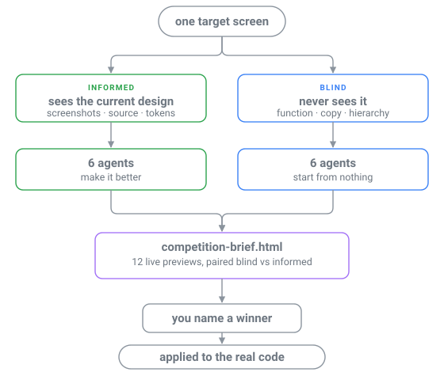

<div align="center">

# 🏟️ Design Arena

**Twelve subagents redesign one screen. You pick the winner. It ships.**

A design competition for any UI, run inside [Claude Code](https://claude.com/claude-code).

[](LICENSE)
[](https://code.claude.com/docs/en/skills)
[](#the-six-taste-engines)

</div>

---

Most AI redesigns polish what's already on screen — useful, until the current design is a **local maximum** and no polish escapes it.

So every design skill runs **twice**. Once *informed*: it sees your screenshots, CSS and tokens, and tries to beat them. Once *blind*: it sees only what the product **does** — copy, actions, hierarchy — and designs from nothing. Twelve self-contained HTML mockups, one gallery, you judge, the winner gets applied to your code.

<div align="center">
  
</div>

## Install

```bash
git clone https://github.com/TalEps77/design-arena.git \
  ~/.claude/skills/design-arena
```

That's the whole setup. The six design skills below don't ship with Claude Code, but **you don't chase them down** — on the first run the arena resolves each one, tells you what's missing and where it comes from, and installs it for you once you approve. Sources and manual commands: [`references/installing-skills.md`](references/installing-skills.md).

## Use

> *"run a design arena on my dashboard"* · *"design bake-off for the landing page"* · *"blind vs informed designs for the settings screen"*

The skill auto-triggers on those, or invoke it directly with `/design-arena`.

## The six taste engines

Every agent must invoke exactly one design skill and design in **its** voice. The default six come from **six different upstreams** — the arena measures six taste engines, not one engine six times.

| | Skill | Upstream | What it brings |
| :-- | :-- | :-- | :-- |
| 🎛️ | [`frontend-design`](https://github.com/anthropics/skills) | anthropics/skills | Anthropic's official baseline — the **control**. If nothing beats it, the other five aren't earning their install. |
| ✂️ | [`design-taste-frontend`](https://github.com/Leonxlnx/taste-skill) | Leonxlnx/taste-skill | The anti-slop engine; layout and restraint |
| 📐 | [`impeccable`](https://github.com/pbakaus/impeccable) | pbakaus/impeccable | Strict design-context protocol, OKLCH color, modular type scales |
| 🎨 | [`ui-ux-pro-max`](https://github.com/nextlevelbuilder/ui-ux-pro-max-skill) | nextlevelbuilder | Searchable databases of styles, palettes, font pairings |
| 🍎 | [`apple-design`](https://github.com/emilkowalski/skills) | emilkowalski/skills | Fluid interfaces — springs, momentum, materials, optical type |
| 🎚️ | [`superdesign`](https://github.com/superdesigndev/superdesign-skill) | superdesigndev | Declares a "Design Read", sets variance/motion/density dials first |

## Blind vs informed

| Track | Sees | Job |
| :-- | :-- | :-- |
| 🟢 **Informed** | Screenshots, source, CSS, tokens, brand notes | Keep what works, fix what's cheap, raise the ceiling |
| 🔵 **Blind** | A functional spec only.<br>**No colors, fonts, layout, or screenshots.** | Invent the strongest direction from nothing |

Each skill runs on **both** tracks, so you compare skill-vs-skill *and* polish-vs-start-clean for the same engine. The blind track only means something if it's airtight: blind agents are barred from opening your source, tokens or screenshots, and the orchestrator greps its own blind brief for leaked hex codes and font names before anything spawns.

## What you get

```
design-arena-output/
├── _context/          # the two briefs + screenshots
├── informed/          # one mockup per skill
├── blind/             # same, built from scratch
├── plans/             # one apply-plan per mockup
└── competition-brief.html   # ← what you judge
```

Every agent writes exactly two files: its **mockup** and its **apply-plan** — direction, token set, which real files change, assets, motion notes, risks. Executable without having watched the agent work.

## The roster

The competing skills live in [`roster.txt`](roster.txt), one per line. It's the single source of truth — the preflight and the gallery builder both read it, nothing hardcodes a list.

```
frontend-design    # the house default — the control
apple-design       # motion-led — judge it full-size
```

A trailing `# note` is printed on that skill's gallery cards. Swap entries freely, with one rule: **keep the lineages distinct.** Six forks of one upstream measure one taste six times — the exact convergence this exists to expose. Every line costs two subagents.

## Notes

> [!NOTE]
> **It's an expensive run.** Twelve agents each loading a skill and writing a full page costs real time and tokens. The skill says so before it spawns; a smaller arena (two skills × two tracks) works identically.

- **One screen, not the whole app.** Twelve takes on "everything" is incomparable mush.
- **Applied means verified** — the real screen renders it and you've seen the screenshot.
- **Blank previews?** Your browser won't frame `file://`. Run `python3 -m http.server 8123 --directory design-arena-output`.

<div align="center">
<sub>MIT — see <a href="LICENSE">LICENSE</a></sub>
</div>
