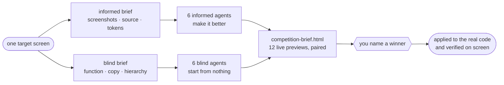

<div align="center">

# 🏟️ Design Arena

**Twelve subagents redesign one screen. You pick the winner. It ships.**

A design competition for any UI, run inside [Claude Code](https://claude.com/claude-code).<br>
Six taste engines × two tracks — one that has seen your design, one that never will.

<sub>

[](LICENSE)
[](https://code.claude.com/docs/en/skills)
[](#the-six-taste-engines)
[](#under-the-hood)

</sub>

[Install](#install) · [Use](#use) · [The split](#why-blind-vs-informed) · [The field](#the-six-taste-engines) · [How it runs](#how-it-runs) · [Roster](#changing-the-roster)

</div>

---

Most AI redesigns polish what's already on screen. That's useful — right up until the current design is a **local maximum**, and no amount of polish escapes it.

So Design Arena runs every design skill **twice**. Once *informed*: it sees your screenshots, your CSS, your tokens, and tries to beat them. Once *blind*: it sees only what the product **does** — copy, actions, hierarchy, constraints — and designs from nothing. Twelve agents, twelve real self-contained HTML mockups, one gallery page. You judge. The winner gets applied to your actual codebase.



---

## Why blind vs informed

| Track | Sees | Job |
| :-- | :-- | :-- |
| 🟢 **Informed** <br><sub>6 agents</sub> | Screenshots, source, CSS, tokens, brand notes | Keep what works, fix what's cheap, raise the ceiling |
| 🔵 **Blind** <br><sub>6 agents</sub> | A functional spec only — copy, actions, hierarchy, constraints.<br>**No colors, fonts, layout, or screenshots.** | Invent the strongest direction from nothing |

Because each skill runs once on **each** track, the gallery lets you compare skill-vs-skill *and* polish-vs-start-clean for the same taste engine. That second contrast is the whole point.

The blind track only means anything if it's airtight, so the skill enforces it: blind agents are forbidden from opening your source, tokens, README or screenshots, and the orchestrator greps its own blind brief for leaked hex codes, font names and units before a single agent spawns. If a blind agent could reconstruct your current design from the brief, the brief gets rewritten.

---

## Install

**Requirements:** Claude Code · Python 3 · Node (for the `npx` installers).

### 1 — The arena

```bash
git clone https://github.com/TalEps77/design-arena.git ~/.claude/skills/design-arena
```

The directory name must be `design-arena` — it has to match the skill's `name:`. Keep `SKILL.md`, `roster.txt`, `scripts/` and `references/` together; the skill reads all four.

### 2 — The six design skills

> [!IMPORTANT]
> **None of them ship with Claude Code.** `frontend-design` is Anthropic-maintained but installed separately; the other five are third-party. A fresh clone of Design Arena finds **zero** of them installed — so this step is not optional.

Four install with the same CLI:

```bash
npx -y skills add anthropics/skills                 --skill frontend-design       --agent claude-code --global --yes
npx -y skills add Leonxlnx/taste-skill              --skill design-taste-frontend --agent claude-code --global --yes
npx -y skills add emilkowalski/skills               --skill apple-design          --agent claude-code --global --yes
npx -y skills add superdesigndev/superdesign-skill                                --agent claude-code --global --yes
```

`impeccable` brings its own installer:

```bash
npx -y impeccable install
```

`ui-ux-pro-max` goes either way — CLI, or as a plugin:

```bash
npm install -g ui-ux-pro-max-cli && uipro init --ai claude
```
```
# …or typed into Claude Code:
/plugin marketplace add nextlevelbuilder/ui-ux-pro-max-skill
/plugin install ui-ux-pro-max@ui-ux-pro-max-skill
```

### 3 — Verify

This is exactly what the skill runs at Step 0:

```bash
bash ~/.claude/skills/design-arena/scripts/check_skills.sh
```

```
frontend-design          OK       frontend-design                  /home/you/.claude/skills/frontend-design
design-taste-frontend    OK       design-taste-frontend            /home/you/.claude/skills/design-taste-frontend
ui-ux-pro-max            OK       ui-ux-pro-max:ui-ux-pro-max      /home/you/.claude/plugins/…/skills/ui-ux-pro-max
apple-design             MISSING

1 skill(s) missing — see references/installing-skills.md for where each one comes from.
```

It prints the **invoke-name** for each skill — a plugin-provided skill is invoked as `plugin:skill`, never by its bare name, and passing the wrong one fails twelve agents at once. Exits non-zero if anything is absent. Skip this and the skill runs it for you, then offers to install what's missing; see [`references/installing-skills.md`](references/installing-skills.md) for every source and command.

---

## Use

Just ask, in plain language:

> *"run a design arena on my dashboard"*<br>
> *"design bake-off for the landing page"*<br>
> *"give me several redesigns to pick from"*<br>
> *"blind vs informed designs for the settings screen"*

The skill auto-triggers on those. Or invoke it directly with `/design-arena`.

---

## The six taste engines

Every agent must invoke exactly one design skill and design in **its** voice — not generically. The default six deliberately come from **six different upstreams**, so the arena measures six taste engines rather than one engine six times.

| | Skill | Upstream | What it brings |
| :-- | :-- | :-- | :-- |
| 🎛️ | [`frontend-design`](https://github.com/anthropics/skills) | anthropics/skills | Anthropic's official baseline — the **control**. If nothing beats it, the other five aren't earning their install. |
| ✂️ | [`design-taste-frontend`](https://github.com/Leonxlnx/taste-skill) | Leonxlnx/taste-skill | The anti-slop engine; layout and restraint |
| 📐 | [`impeccable`](https://github.com/pbakaus/impeccable) | pbakaus/impeccable | Strict design-context protocol, OKLCH color, modular type scales |
| 🎨 | [`ui-ux-pro-max`](https://github.com/nextlevelbuilder/ui-ux-pro-max-skill) | nextlevelbuilder | Searchable databases of styles, palettes, font pairings |
| 🍎 | [`apple-design`](https://github.com/emilkowalski/skills) | emilkowalski/skills | Fluid interfaces — springs, momentum, materials, optical type |
| 🎚️ | [`superdesign`](https://github.com/superdesigndev/superdesign-skill) | superdesigndev | Declares a "Design Read", sets variance/motion/density dials first |

Keeping `frontend-design` in the field is deliberate. Without a control you learn which specialist skill *you liked most*, not whether any of them beat what Claude already does — so the skill is told to volunteer that comparison when it presents the gallery.

---

## How it runs

| | Step | What happens |
| :-- | :-- | :-- |
| **0** | **Preflight** | Resolve every roster skill + its invoke-name. Missing ones are named, not silently dropped |
| **1** | **Scope** | Pin **one** screen and one fidelity target: a single self-contained HTML file |
| **2** | **Two briefs** | Write `informed-brief.md` and `blind-brief.md`, then grep the blind one for leaks |
| **3** | **Spawn** | 12 agents in parallel, one skill each, two files each |
| **4** | **Assemble** | `build_brief.py` renders the live-preview gallery |
| **5** | **Judge** | You open the gallery and name a winner |
| **6** | **Apply** | Winning skill + its plan applied to the real code — and verified on screen |

Every agent writes exactly two files: its **mockup** (`.html`) and its **apply-plan** (`.md`) — design direction, token set, which real files change, fonts and assets to add, motion notes, risks. Someone can execute that plan without having watched the agent work.

### What you get

```
design-arena-output/
├── _context/
│   ├── informed-brief.md      # full visual + functional brief
│   ├── blind-brief.md         # functional only, visuals stripped
│   └── shots/                 # current-design screenshots (informed track only)
├── informed/                  # one mockup per roster skill
├── blind/                     # same filenames, built from scratch
├── plans/                     # one apply-plan per mockup
└── competition-brief.html     # ← the gallery you judge
```

The gallery pairs each skill's two takes side by side, so the comparison you actually care about is one glance wide:

```
  apple-design
  ┌─────────────────────────┐  ┌─────────────────────────┐
  │ apple-design   INFORMED │  │ apple-design      BLIND │
  │ motion-led: judge full… │  │ motion-led: judge full… │
  ├─────────────────────────┤  ├─────────────────────────┤
  │                         │  │                         │
  │   ‹ live iframe ›       │  │   ‹ live iframe ›       │
  │                         │  │                         │
  ├─────────────────────────┤  ├─────────────────────────┤
  │ open full ↗  plan ↗     │  │ open full ↗  plan ↗     │
  └─────────────────────────┘  └─────────────────────────┘
```

---

## Changing the roster

The competing skills live in [`roster.txt`](roster.txt) — one per line, in gallery order. It is the **single source of truth**: the preflight and the gallery builder both read it, and nothing hardcodes a list.

```
frontend-design         # the house default — the control entry
design-taste-frontend
impeccable
ui-ux-pro-max
apple-design            # motion-led — judge full-size, not from the still preview
superdesign
```

A trailing `# note` is printed on that skill's gallery cards — use it for anything a scaled, static preview can't convey. `apple-design` ships with one, because a still frame can't show a spring.

Swap entries freely. One rule: **keep the lineages distinct.** Six skills forked from the same upstream measure one taste engine six times, which is the exact convergence this whole apparatus exists to expose. `Leonxlnx/taste-skill` alone also ships `high-end-visual-design`, `minimalist-ui` and `industrial-brutalist-ui`; any design skill can take a slot. Every line costs two subagents.

---

## Under the hood

```
design-arena/
├── SKILL.md                   # the skill — the 6-step procedure the agent follows
├── roster.txt                 # the competing skills — single source of truth
├── references/
│   └── installing-skills.md   # every skill's upstream + install command (read on preflight failure)
└── scripts/
    ├── check_skills.sh        # Step 0 — resolves skills across project, user and plugin scopes
    └── build_brief.py         # Step 4 — builds the gallery
```

Both scripts are standalone and deterministic — no dependencies beyond Python 3 and bash:

```bash
python3 scripts/build_brief.py design-arena-output
```

`build_brief.py` scans both track directories, embeds each mockup as a scaled live `<iframe>`, badges every card, pairs blind-vs-informed, links each card to its full-size mockup and its apply-plan, and writes `competition-brief.html`. It also reports which mockups and plans never showed up and exits non-zero if nothing was produced — a half-finished round can't quietly pass for a complete one.

---

## Notes

> [!NOTE]
> **It's an expensive run.** Twelve agents each loading a skill and writing a full page costs real time and tokens. The skill says so before it spawns — and a smaller arena (two skills × two tracks) works exactly the same way.

- **One screen, not the whole app.** Designing "everything" twelve times produces incomparable mush. One strong screen produces a clean decision.
- **A failed agent doesn't block the round.** Respawn that one, or let the gallery mark it absent.
- **Twelve parallel agents is heavy.** If the environment struggles, run two waves of six — but keep the briefs identical.
- **Applied means verified.** A redesign isn't done until the real screen renders it and you've seen the screenshot.

> [!TIP]
> **Previews coming up blank?** Your browser is refusing to frame `file://` pages. Serve the folder instead:
> ```bash
> python3 -m http.server 8123 --directory design-arena-output
> ```

---

<div align="center">
<sub>MIT — see <a href="LICENSE">LICENSE</a></sub>
</div>
